# KLEE

## 先修知识

## 符号执行

- 符号执行是一种程序分析技术，和模糊测试的思路不一样，模糊测试是吧测试对象当做一个黑盒子，不深入理解内部原理。符号执行是白盒测试技术，是基于程序分析的。或者说是一种程序分析技术，需要解析程序的源码（或者至少是反汇编后的汇编代码）。黑盒测试主要通过操纵其公开接口对软件进行评估，其中最知名的黑盒测试是模糊测试（Fuzzing）。模糊测试或者模糊化是一种软件测试技术，通常是自动化或者半自动化的，它能提供有效的、未预期的、随机的数据作为程序的输入。

- 模糊测试能产生很多崩溃，分析人员通过这些崩溃作为分析问题的起点，以便确定漏洞的可利用性。然而，因为对程序控制流缺乏语义上的理解，模糊测试有代码覆盖率低的缺陷，即使是当前最高级的模糊测试技术也很难完全覆盖大型程序的所有路径。举个例子，对于以整形数据为路径分支条件，含有长为32比特的常量的约束等式条件（如if(v==4)），Fuzzing测试仍然有可能达到其上限次数（2^32次尝试）才能找到使得此等式为true的值。那么这个if为true分支被测试到的可能性极低。

- 符号执行就是为解决这个问题而设计的。符号执行作为一种能够系统性探索程序执行路径的程序分析技术，能有效解决模糊测试冗余测试用例过多和代码覆盖率低这两个问题。

- 符号执行的主要思想是以符号输入代替程序的实际输入，以符号值代替程序运行过程中的实际值，并以符号布尔表达式表示程序中的分支条件。这样，一条程序执行路径就包含了一系列的符号变量、表达式赋值以及约束条件等，程序中的各路径的信息能以符号的形式被完整记录和保存。我们把某条执行路径上的所有分支条件所组成的约束集（Constraint Set）称为路径约束或路径条件（PC, Path Constraint，Path Condition）。符号执行的主要目的是通过对路径约束的求解来判断此条路径的可达性（Feasibility），并能给出执行此条路径的实际测试输入。

- 这个描述有点抽象，简单来说，符号执行的目的是覆盖程序执行的每一个分支。方法就是查看和收集程序执行过程中每一个分支条件的具体条件，把这些具体条件收集起来，变成一个数学的表达式，然后通过一些方法自动化的求解这些表达式，得到满足执行程序的路径的具体的输入的值。就可以覆盖特定的程序分支了。

- 举个例子
  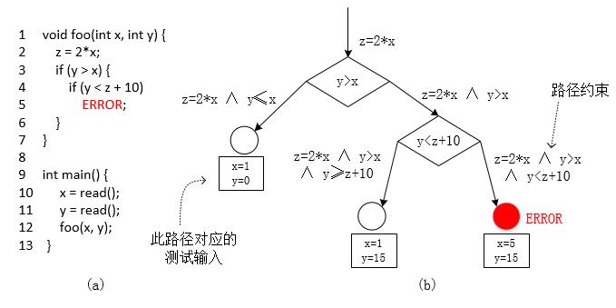                              

- 这个图，左边的是一段示例代码，一共13行，包括两个函数，一个main函数，一个foo函数。程序有两个输入，从外部读入的数据x和y。foo函数以x和y作为条件，内部有分支。假设在第五行有一个bug。我们的目的是有一种自动化的方法来找出这个bug。
- 前面已经说了Fuzzing技术在某些特定情况下有可能极其小得概率才能覆盖到特定分支，所以Fuzzing技术最大的问题就是代码覆盖率不高。对于穷尽每个执行路径目标来说有点难。
- 那么符号执行在解析代码的情况下，首先把程序的每一个分支画出来。形成一个称为符号执行树的数据结构。这个符号执行树，和程序的控制流图有点类似。但是它要明确每个分支的具体的执行路径条件。比如第一个分支的执行条件是y>x，第二个分支的执行条件是y< z+10 。x和y都是输入数据，在数学上来说，都是未知数。如果我们能够有一种方法，可以求解y>x的一个满足解和一个不满足解。那么是不是就找到了覆盖两个分支的两个测试用例。同样，对第二分支来说，在满足y>x的情况下，同时再满足y< z+10或者不满足 y< z+10，就能得到两个二级分支的具体的输入数据。
- 这里多了一个变量z，通过分析代码发现，z并不是一个新的数据数据，所以他并不是未知数，而是其他未知数赋值而来，所以每一个步，我们都记录下这种赋值关系，形成一个“表达式组”，或者，说得简单点，我们初中的时候学的“不等式组”。
- 理论上来讲，每一个程序执行的分支，每一个“执行路径”都有一个确定的不等式组作为执行条件。我们称为“约束”。
- 如果能求解到这个不等式组的一个解，那么就可以构造出专门覆盖这条路径的测试数据了。我们称为“约束求解”
- 这里，对于我们想要找的那个bug，第五行的代码。最终形成一个这样的“约束条件”
  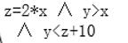                             
  是这一个具体路径的路径约束。

下面的问题就是如何求解这个约束。我们的目的当时是自动化求解，不是人工求解。而且我们的目的是得到一个满足解即可，不用得到解析解。也就是只需要得到一个满足这个不等式组的具体的值，就等达到目的。

- 如果我们把每一个路径的约束全部求解一遍，那么我们就能得到100%代码覆盖率的测试数据集。能够充分测试一个软件，找出软件中所有潜在的bug和漏洞。

- 想法很好，难度很大。符号执行技术在上个世纪70年代被提出之后，受限于当时计算机的计算能力和约束求解技术的不足，并没有取得太大的进展。近年来，由于可满足模理论(SMT)研究以及动态符号执行技术的提出和应用使得符号执行技术研究有了革命性的进展，并已经被学术界和业界广泛应用于软件测试、漏洞挖掘、模型验证等领域。
  也就是上面那个基本想法，已经提出来50年了。但是我们一直找不到一种自动化求解约束表达式的方法，所以也停留在理论层面。但是最近十几二十年情况不一样了。我们有了一种新的方法，并且开发出了工具，可以做到了。

- 抽象一点，布尔可满足性问题（SAT，Boolean Satisfiability Problem），又称为命题可满足性问题（Propositional Satisfiability Problem），通常缩写为SATISFIABILITY或者SAT。布尔可满足性问题主要作用是在使用某种特定的语言描述对象（变量）的约束条件时，求解出能够满足所有约束条件的每个变量的值。SAT求解器已经被用于解决模型检查、形式化验证和其它包括成千上万变量和约束条件的复杂问题。但SAT问题是个NP完全问题，具有比较高的复杂度，且直接使用SAT求解器对程序进行分析的话需要需将问题转化为CNF形式的布尔公式，这给转化工作带来很大的困难。

- 学过算法复杂度的同学知道，数学家已经证明了所有的NPC问题，都可以转化为SAT问题，后来发现一种算法，可以缓解这个问题，并在一定程度上求解。具体算法我们不用去深入了解，因为前人已经开发出工具了，简而言之是一种基于多维空间收敛搜索的方法。

## SAT 求解器

- 这个工具呢，我们称为 SAT 求解器。或者他的变种SMT 求解器。可满足模理论(SMT，Satisfiability Modulo Theories)主要用于自动化推论（演绎），学习方法，为了检查对于一些逻辑理论T的一阶公式的可满足性而提出的。SMT技术主要用于支持可推论的软件验证，在计算机科学领域已经被广泛应用于模型检测（Model Checking），自动化测试生成等。可以被用于检查基于一种或多种理论的逻辑公式的可满足性问题。典型的应用理论主要包括了各种形式的算术运算（Formalizations of Various Forms of Arithmetic），数组（Arrays），有限集（Finite Sets），比特向量（Bit Vectors），代数数据类型（Algebraic Datatypes），字符串（Strings），浮点数（Floating Point Numbers），以及各种理论的结合等。

- 相对于SAT求解器，而言SMT求解器不仅仅支持布尔运算符，而且在使用SMT求解器的解决问题的时候不需要把问题转化成复杂的CNF范式，这使得问题得以简化。

- 不过说白了就是一个结论，上面我们总结出来的“约束求解”问题有自动化的方法了，而且已经有人开发了工具了。而且不止一款，有很多款这样的工具。其中比较优秀的是Z3，微软研究院开发的。
  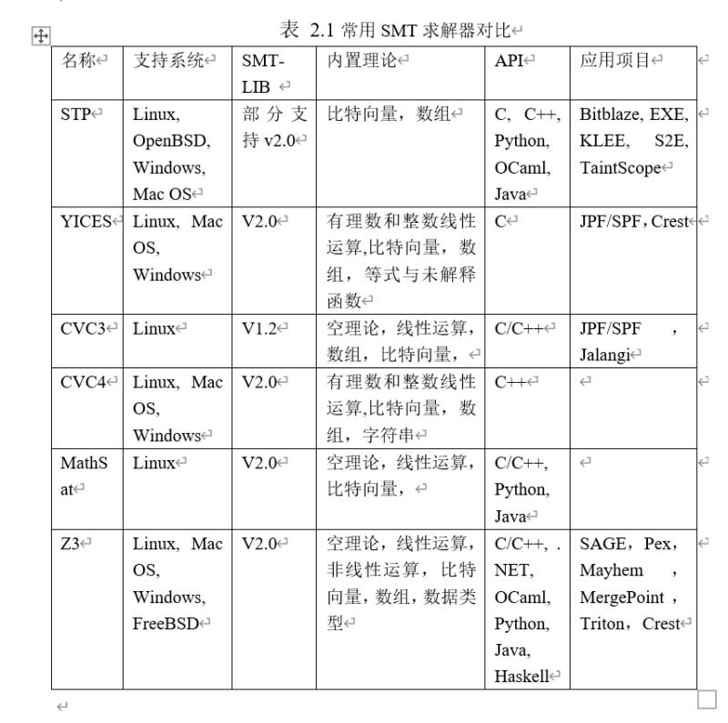

- 来看[具体例子](https://rise4fun.com/z3)，约束求解器是怎么用到。

- 打开网页以后，先看到左上。

  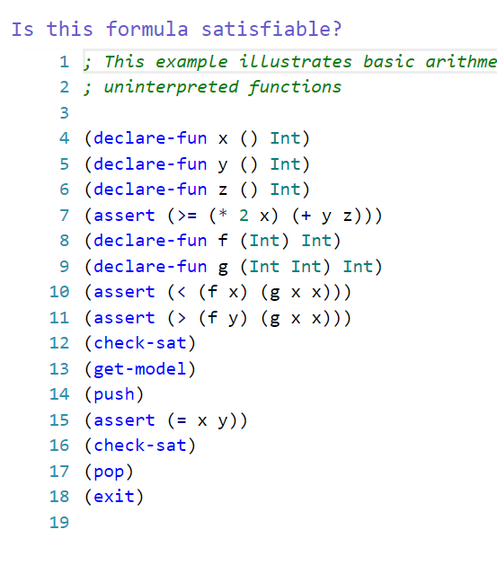

- 这个是SMT 求解器使用的一种描述语言。来描述变量之间的约束关系。

- 我们来简化一下。

  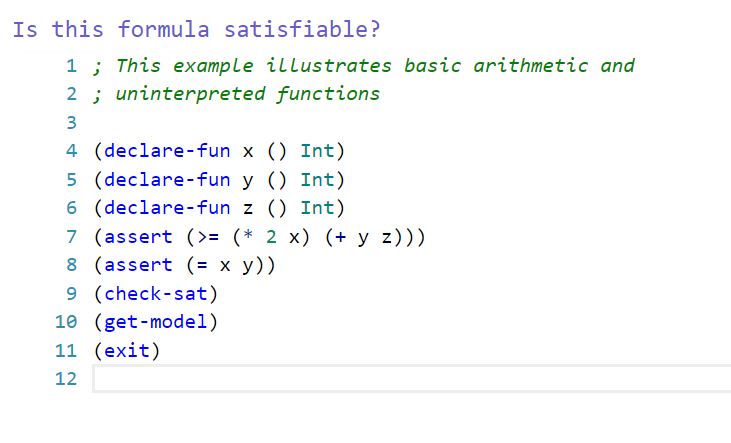

  ```c
  ; This example illustrates basic arithmetic and 
  ; uninterpreted functions
  
  (declare-fun x () Int)
  (declare-fun y () Int)
  (declare-fun z () Int)
  (assert (>= (* 2 x) (+ y z)))
  (assert (= x y))
  (check-sat)
  (get-model)
  (exit)
  ```

- 这个formula呢，按照工具的要求语法，写成一种固定的形式。一二行是注释，3、4、5三行相当于定义了三个变量。这三个变量都是Int型的。7、8两行就是定义了两个约束。运算符写在前面，运算数写在后面。第一个约束表达式实际是。2*x >= y+z 9 10 11行是要求求解器做三个具体的事情。第一个是检测是否这个表达式是否满足。也就是有解还是没有解。当然会有没有解的表达式组的。例如 x>y and x<y 不管xy怎么取值，都没有解。就是一个不满足的情况。

- 那么我们这个例子中，工具给出的结果是满足 sat。然后是要 get-model，其实就是得到解。一个具体的满足解。然后求解器给出了x=0 y=0 z=0就能满足两个约束。11行就简单了，告诉求解器，工作做完了可以退出。有了这个工具，之前图里的那个例子就能自动化了。

- SMT-LIB（The satisfiability modulo theories library）自从2003年开始发起的为SMT理论研究提供标准化支持的项目，旨在促进SMT理论的研究和开发。SMT-LIB的目的主要如下：为SMT系统提供标准化严谨的背景理论描述；发展和促进SMT求解器的输入和输出语言；为SMT求解器研究团队建立和提供大型测试集library等。
  定义 如果对于用户声明(declare)的常量和函数，存在一个解（interpretation0能使全局栈里面的所有的公式集（the set of formulas）为true，则我们称这些公式集是可满足（satisfiable）的。

- 再举个例子

  

- 这个为SMT-LIB V2语言在实际约束求解中的应用。其中declare-fun 命令用于声明一个函数，当函数里面参数为空时，表示声明一个符号常量；assert命令用于添加一个约束式formula到SMT全局栈里面；check-sat 命令决定在栈里面的公式（formulas)是否是可满足的，如果是，则返回sat，如果不满足（not satisfiable，即unsatisfiable)，则返回unsat，如果求解器无法根据已有的formula决定是否满足，则返回unknown；get-value命令用于在check-sat命令返回的结果是sat的前提下获取满足使SMT求解器全局栈中所有formulas为true的其中的一个解。当前很多非常著名的软件测试工具都采用了符号执行技术，而且已经有很大一部分开放了源代码。例如：NASA的Symbolic (Java) PathFinder，伊利诺大学香槟分校（UIUC）的 CUTE和jCUTE，斯坦福大学（Stanford）的 KLEE, 加利福尼亚大学伯克利分校（UC Berkeley）的 CREST和 BitBlaze，瑞士洛桑联邦理工学院（EPEL）的S2E，卡内基梅隆大学（CMU）的Mayhem和Mergepoint，加利福尼亚大学圣巴巴拉分校（UC Santa Barbara）的angr等。
  在工业领域也有符号执行工具被广泛使用，如Microsoft(Pex, SAGE, YOGI和PREfix), IBM (Apollo), NASA 和Fujitsu的 (Symbolic PathFinder)等。可以看出来，符号执行确实是计算机领域一个非常重要的研究点。很多著名大学都在研究这个东西。

- 上面说了这么多符号执行工具，这些工具是把我们刚才说的整个过程都实现了：根据代码生成符号执行树->收集路径的约束->转为SMT-LIB格式->输入给约束求解器->验证路径可达或者不可达，可达的情况下获得解->根据解自动构造输入数据,但是不同的符号执行工具在实现时有不同比如KLEE，只能分析C源码程序。后续的一些工具可以分析二进制程序。

- KLEE是开源的，而且比较成熟[文档](https://klee.github.io/)比较多，我们来学习一下。

- KLEE能实现全自动化，唯一的缺点是需要在程序中进行少量的修改。这个 klee_make_symbolic(&a, sizeof(a), "a");的作用就是a标记为需要求解的输入数据。

  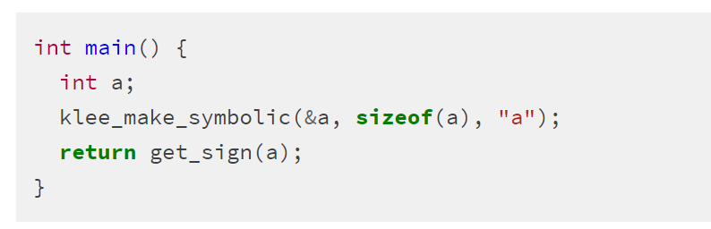

- BitBlaze还有一些后续工具，能够实现输入数据的自动识别，更高级一些。使用KLEE一共就几个步骤：准备一份源码，标记要分析的输入数据，编译，使用KLEE来运行编译后的程序，得到KLEE自动生成的测试用例。最后把所有输入测试用例循环输入给被测试程序，完成自动测试。

- 按照[官方的教程](https://klee.github.io/tutorials/testing-function/)，做一遍，比较简单,环境是Linux

- [自动走迷宫](https://github.com/grese/klee-maze)

- 符号执行的主要问题。

  - 当程序中有循环的时候，按照符号执行树，每一个分支条件都是需要展开。这会造成程序的路径非常多。循环是程序的一个基本结构，普遍存在的。这种情况要遍历每一个路径，实际路径数量会非常巨大。造成消耗的时间不可行。这个问题称为路径爆炸，路径的数据量是分支数量的指数级。循环更加强了这个问题。还有当程序路径非常多，输入变量非常多的时候，会超过SMT求解的求解能力。所以对大型程序，目前符号执行只是一种辅助性的手段。但是这种技术是有前景的，随着计算能力的增强，算法的优化和改进，未来可能成为程序分析、程序自动化测试和程序安全性分析的主要的形式化的方法。

- 最后补充一点，KLEE当然不是使用的在线版本的示例性质的约束求解器。而是直接调用本地的二进制程序。Windows和Linux下都有Z3的可执行程序，Windows系统中是z3.exe，可以在官网下载。

## 课后实验

### 安装KLEE

实验环境：vbox+Ubuntu18.04server

```bash
#################### 安装docker ############################
#更新apt包索引：
$ sudo apt-get update
#安装以下包以使apt可以通过HTTPS使用存储库（repository）：
$ sudo apt-get install -y apt-transport-https ca-certificates curl software-properties-common
#添加Docker官方的GPG密钥：
$ curl -fsSL https://download.docker.com/linux/ubuntu/gpg | sudo apt-key add -
#使用下面的命令来设置stable存储库：
$ sudo add-apt-repository "deb [arch=amd64] https://download.docker.com/linux/ubuntu $(lsb_release -cs) stable"
#再更新一下apt包索引：
$ sudo apt-get update
#安装最新版本的Docker CE：（需要一定时间）
$ sudo apt-get install -y docker-ce

################### 验证docker安装成功 #######################
#查看docker服务是否启动：
$ systemctl status docker
#若未启动，则启动docker服务：
$ sudo systemctl start docker
#经典的hello world：
$ sudo docker run hello-world

################### 在docker中安装klee #######################
# 启动 docker
systemctl start docker
# 安装 KLEE
docker pull klee/klee:2.0

# 创建一个临时容器(为了测试实验用)
docker run --rm -ti --ulimit='stack=-1:-1' klee/klee:2.0

# 创建一个长期容器
sudo docker run -ti --name=klee_li --ulimit='stack=-1:-1' klee/klee
# 退出后可通过名字再次进入
sudo docker start -ai klee_li
# 删除长期容器
docker rm klee_container
```


### 实例1 [Testing a small function](http://klee.github.io/tutorials/testing-function/)

这个例子是引导我们熟悉使用klee测试简单函数所需的主要步骤，代码在/examples/get_sign目录下.
简单函数的代码如下，判断x的是0、正数、还是负数。

```c
#include <klee/klee.h>

int get_sign(int x) {
  if (x == 0)
    return 0;


  if (x < 0)
    return -1;
  else
    return 1;}

int main() {
  int a;
  klee_make_symbolic(&a, sizeof(a), "a");
  return get_sign(a);
}
```

1. 把输入符号化
为了使用KLEE测试这个函数，我们首先需要用符号化的输入去运行这个函数，klee提供了klee_make_symbolic()函数（定义在klee/klee.h中）将变量符号化，该函数接收3个参数：变量地址、变量大小、变量名（可以为任何值）。

2. 编译为LLVM位码
    klee是基于LLVM位码的，因此我们首先需要将程序编译为LLVM位码，在klee_src/examples/get_sign目录下运行命令：

  ```bash
  $ clang -I …/…/include -emit-llvm -c -g -O0 -Xclang -disable-O0-optnone get_sign.c
  
  # 解释命令参数：
  -I<dir>:添加目录到include搜索路径，这样我们的编译器才能找到klee/klee.h，里面定义了很多我们需要与klee虚拟机进行交互的内部函数，比如klee_make_symbolic.
  -emit-llvm：对汇编程序和对象文件使用LLVM表示。
  -c：只运行预处理、编译和汇编步骤。
  -g：将调试信息添加到位代码文件中，以便之后使用该文件生成源代码行级别的统计信息。
  ```

  

3. 运行KLEE
    仍然在该目录下，直接执行命令：`$ klee get.sign.bc` ,得到以下输出

  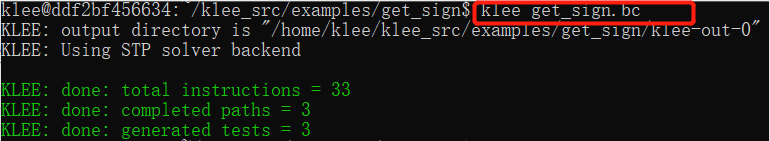

  一共有33条指令，3条路径，并生成了3个测试用例。3条路径分别是 a = 0, a < 0和 a >0.

  当前目录下多生成了两个文件：**klee-last** 和 **klee-out-0。**其中klee-out-0是本次测试结果，klee-last是最新测试结果，每次测试后覆盖。klee每执行一次都会生成一个klee-out-N，其中N是表示第几次的执行，这里我们只执行了一次，因此是0。查看下该目录：

  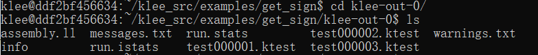

4. 利用KLEE生成测试用例
    klee生成的测试用例都写在.ktest后缀的二进制文件中，可以通过ktest-tool工具查看:

  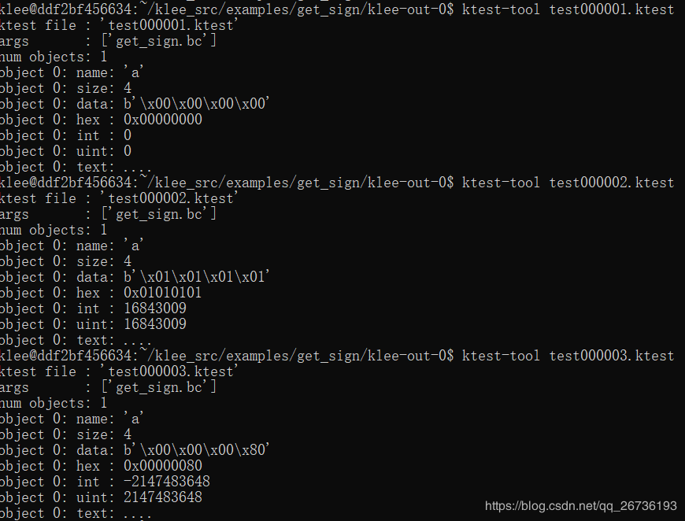

  这3个文件对应了我们之前得到输出的3个测试用例。

  ```bash
  # 从这些文件里面，我们可以得到 ：
  args: 调用程序时使用的参数,这个例子中只有程序名。
  num objects: 符号对象在路径上的数量，在这个例子中只有1个。
  object 0: name: 符号对面的名字
  object 0 :int/uint: 符号对象实际的输入值（这里3个分别对应=0,>0,<0）
  ```

  

5. 重新使用测试用例运行程序
    现在，我们可以用klee提供的库来将得到的测试用例作为输入来运行我们的程序。

  ```bash
  # 首先我们需要将我们的程序链接到klee提供的库libkleeRuntest：
  $ export LD_LIBRARY_PATH=path-to-klee-build-dir/lib/:$LD_LIBRARY_PATH
  $ gcc -I …/…/include -L path-to-klee-build-dir/lib/ get_sign.c -lkleeRuntest
  
  # 输入如下命令：
  # path-to-klee-build-dir 是自己klee_build的目录
  $ export LD_LIBRARY_PATH=/home/klee/klee_build/lib/:$LD_LIBRARY_PATH
  $ gcc -I …/…/include -L /home/klee/klee_build/lib/ get_sign.c -lkleeRuntest
  
  # 设置KTEST_FILE环境变量指向所需要测试的用例名：
  $ KTEST_FILE=klee-last/test00000N.ktest ./a.out
  ```

  3个测试用例，结果如下：

  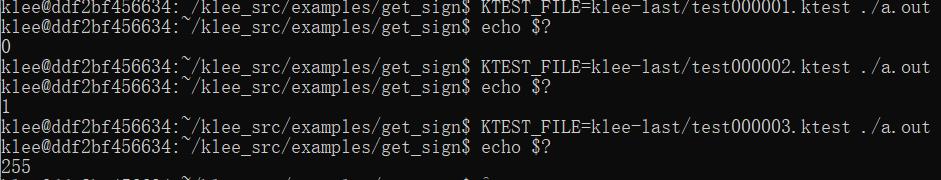

  当我们用第一个用例测试，a=0，我们返回值也是0；

  第二个用例a=16843009,我们返回值为1；

  第三个用例a=-2147483648,返回值为-1（这里转换到了0-255范围，因此为255）。

  

  


### 实例2 [Testing a Simple Regular Expression Library](http://klee.github.io/tutorials/testing-regex/) 

1. 编译生成LLVM位码源码所在目录为example/regexp，到该目录下执行：

   ```bash
   $ clang -I ../../include -emit-llvm -c -g -O0 -Xclang -disable-O0-optnone Regexp.c
   ```

   

2. 用KLEE执行代码

   ```bash
   $ klee --only-output-states-covering-new Regexp.bc
   # 参数 –only-output-states-covering-new 用来限制生成测试用例，只有在覆盖了新的代码时才生成。
   ```

   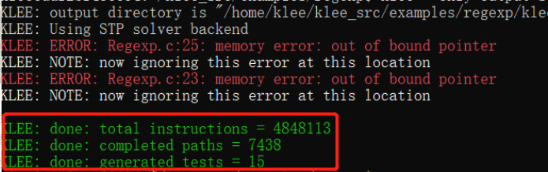

   一共执行了4848113条指令，探索了7438条路径并生成了15个测试用例,还报了2个错误

3. KLEE错误报告
   当klee检测到正在执行的程序中的错误时，它将生成一个显示错误的测试用例，并将有关该错误的一些附加信息写入文件testN.TYPE.err,N是测试用例的标号，TYPE显示错误的类型.klee发现程序中2个内存错误不是因为正则函数中存在bug，而是测试驱动中存在一个问题。将输入完全符号化了，但是匹配函数期待的是以null为结尾的字符串。
   所以在这个buffer的结尾添加’\0’。把main函数改成如下：

   ```c
   int main() {
     // The input regular expression.
     char re[SIZE];
   
     // Make the input symbolic.
     klee_make_symbolic(re, sizeof re, "re");
     re[SIZE - 1] = '\0';
   
     // Try to match against a constant string "hello".
     match(re, "hello");
   
     return 0;}
   ```

   

4. 重新编译并用klee运行：

   ```bash
   $ clang -I …/…/include -emit-llvm -c -g -O0 -Xclang -disable-O0-optnone Regexp.c
   $ klee --only-output-states-covering-new Regexp.bc
   ```

   错误解决

   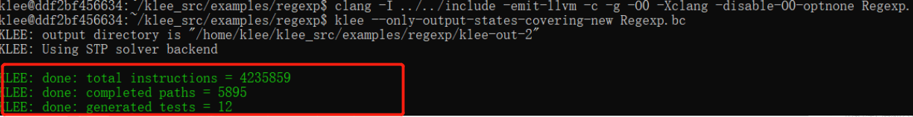

   

   

### 实例3  [Solving a maze with  KLEE](https://feliam.wordpress.com/2010/10/07/the-symbolic-maze/) 

实例中的迷宫大小为11X7，玩家通过’w’,‘s’,‘d’,'f’操作上下左右，从X出发，要找到路径达到出口

下载迷宫程序

```bash
# Update aptitude 
sudo apt-get update
# Install git 
sudo apt-get install -y git-core
# Download maze 
git clone https://github.com/grese/klee-maze.git ~/maze


# Build & Run Maze
# Source is in maze.c.
cd ~/maze

#Build: 将代码编译，得到可执行文件maze.exe
gcc maze.c -o maze
#Run manually: 
./maze
#Input a string of "moves" and press "enter"
#Allowed moves: w (up), d (right), s (down), a (left)
#执行并输入路径ssssddddwwaawwddddssssddwwww可手动找到迷宫出口
#Example solution: ssssddddwwaawwddddssssddwwww
#Run w/solution: 
cat solution.txt | ./maze
```

用KLEE来找我们的结果

代码

```c
/**
 * maze_klee.c
 * The maze from maze.c with Klee "symbolic execution" 
 * and "assertions" added.
 * 
 * Create LLVM bytecode: ./build_bc.sh
 * 
 * Run with Klee: ./run_klee.sh
 * 
 * Find solutions: ./show_solutions.sh
 */

#include <klee/klee.h>
#include <stdlib.h>
#include <stdio.h>
#include <unistd.h>

#define H 7
#define W 11
#define ITERS 28

char maze[H][W] = {
    "+-+---+---+",
    "| |     |#|",
    "| | --+ | |",
    "| |   | | |",
    "| +-- | | |",
    "|     |   |",
    "+-----+---+"
};

void draw ()
{
    int i, j;
    for (i = 0; i < H; i++)
    {
        for (j = 0; j < W; j++)
        {
            printf("%c", maze[i][j]);
        }
        printf("\n");
    }
    printf("\n");
}

int main (int argc, char *argv[])
{
    int x = 1, y = 1;    //Player position
    int ox, oy;          //Old player position
    int i = 0;           //Iteration number
    char program[ITERS];

    maze[y][x] = 'X';

    // Use Klee's symbolic execution
    klee_make_symbolic(program, ITERS, "program");

    while(i < ITERS)
    {
        //Save old player position
        ox = x;
        oy = y;

        switch (program[i])
        {
        case 'w':
            y--;
            break;
        case 's':
            y++;
            break;
        case 'a':
            x--;
            break;
        case 'd':
            x++;
            break;
        default:
            printf("Wrong command! (only w,s,a,d accepted!)\n");
            printf("You lose!\n");
            exit(-1);
        }

        if (maze[y][x] == '#')
        {
            printf("You win!\n");
            printf("Your solution %s\n", program);
            klee_assert(0); // Klee assertion identifies the win
            exit(1);
        }

        if (maze[y][x] != ' ' && !((y == 2 && maze[y][x] == '|' && x > 0 && x < W)))
        {
            x = ox;
            y = oy;
        }

        if (ox==x && oy==y)
        {
            printf("You lose\n");
            exit(-2);
        }

        maze[y][x]='X';
        draw();    //draw it

        i++;
        sleep(1);    //wait for next input
    }

    printf("You lose\n");
}
```


首先修改源代码，符号化输入，

```c
read(0,program,ITERS);
修改为下面：
klee_make_symbolic(program,ITERS,"program");
并添加头文件：
#include<klee/klee/h>
```

将 maze.c编译为maze.bc，并在/examples/maze下执行命令：

```bash
$ clang -c -I …/…/include -emit-llvm maze.c -o maze.bc
$ klee maze.bc
```

最终生成结果：

```bash
KLEE: done: total instructions = 134318
KLEE: done: completed paths = 309
KLEE: done: generated tests = 309
```

`ls klee-last`可以看到对于309个测试用例每个都单独有一个报告

查看其中一个报告的内容：

```bash
klee@ddf2bf456634:~/klee_src/examples/maze$ ktest-tool klee-last/test000309.ktest
\ktest file : ‘klee-last/test000309.ktest’
args       : [‘maze.bc’]
num objects: 1
object 0: name: ‘program’
object 0: size: 28
object 0: data: b’ssssddddwwaawwddddsddsssaaww’
object 0: hex : 0x73737373646464647777616177776464646473646473737361617777
object 0: text: ssssddddwwaawwddddsddsssaaww
```

函数klee_assert()，它强制条件为真，否则就会中止执行。我们可以用断言来标记我们感兴趣的部分代码，一旦KLEE执行到这个地方就会给出提醒。

修改源码

```c
printf("You win!\n");
//修改为
printf ("You win!\n");
klee_assert(0);  
```

当我们源代码执行了printf(“You win!\n”)时表明我们找到了正确的答案，因此我们在这行代码后面添加klee_assert(0)，即一个条件永远为0的断言，这样只要执行到了这里断言就会报错，这样我们就有了一个标识告诉我们找到了答案。

重新编译、执行：

```bash
$ clang -c -I …/…/include -emit-llvm maze.c -o maze.bc
$ klee maze.bc
```

得到结果

```bash
KLEE: done: total instructions = 134310
KLEE: done: completed paths = 309
KLEE: done: generated tests = 306
klee@ddf2bf456634:~/klee_src/examples/maze$ ls klee-last assembly.ll
test000059.ktest  test000122.ktest       test000183.ktest
test000246.ktest info              test000060.ktest  test000123.ktest
test000184.ktest  test000247.ktest messages.txt      test000061.ktest
test000124.ktest       test000185.ktest  test000248.ktest run.istats
test000062.ktest  test000125.ktest       test000186.ktest
test000249.ktest run.stats         test000063.ktest  test000126.ktest
test000187.ktest  test000250.ktest …            …
…                 …            … test000012.ktest
test000075.ktest  test000138.assert.err   test000199.ktest
test000262.ktest test000013.ktest  test000076.ktest  test000138.kquery
test000200.ktest  test000263.ktest …            …
…                 …            …

```

test000138.assert.err的错误报告文件，这应该就是找到了正确答案的测试用例了，查看

```bash
klee@ddf2bf456634:~/klee_src/examples/maze/klee-last$ ktest-tool test000138.ktest
ktest file : ‘test000138.ktest’
args       : [‘maze.bc’]
num objects: 1
object 0: name: ‘program’
object 0: size: 28
object 0: data: b’sddwddddsddw\xff\xff\xff\xff\xff\xff\xff\xff\xff\xff\xff\xff\xff\xff\xff\xff’
object 0: hex : 0x736464776464646473646477ffffffffffffffffffffffffffffffff
object 0: text: sddwddddsddw…

```

试验一下，发现穿墙了

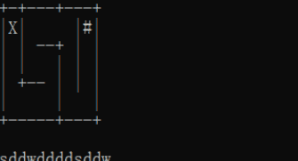

问题在源代码这，多了一个判定条件，等于把第二列的‘|’都设置成了虚假墙壁了

```c
//If something is wrong do not advance
if (maze[y][x] != ' '
       &&
     !((y == 2 && maze[y][x] == '|' && x > 0 && x < W)))
  {
     x = ox;
     y = oy;
  }

```

klee对于由同一位置到达的错误只会报告一次。因此，这里我们需要用到参数：-emit-all-errors

```bash
$ klee -emit-all-errors maze.bc
```

得到结果

```bash
KLEE: done: total instructions = 134310
KLEE: done: completed paths = 309
KLEE: done: generated tests = 309
```

查看报告之后也一共有4个.assert.err的文件

```bash
$ ./scripts/show_solutions.sh #显示最后结果
TESTID       SOLUTION
test000135:  sddwddddsddw................
test000211:  ssssddddwwaawwddddsddw......
test000251:  sddwddddssssddwwww..........
test000301:  ssssddddwwaawwddddssssddwwww
```

试验结果没有问题

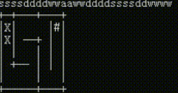


