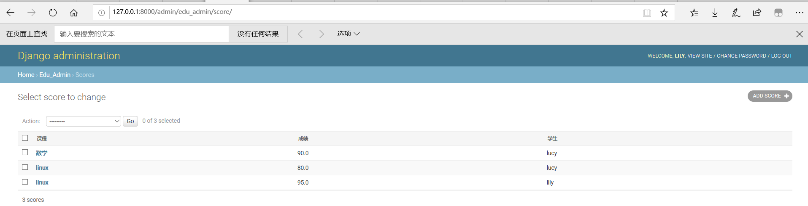

# SQL注入

## 实验环境

- windows 10
- django、sqlite

## 实验原理

所谓SQL注入，就是通过把SQL命令插入到Web表单递交或输入域名或页面请求的查询字符串，最终达到欺骗服务器执行恶意的SQL命令。sql注入攻击是利用是指利用设计上的漏洞，在目标服务器上运行Sql语句以及进行其他方式的攻击，动态生成Sql语句时没有对用户输入的数据进行验证是Sql注入攻击得逞的主要原因。

## 实验过程

#### 安装django

```bash
python -m pip install --upgrade pip
pip install Django
```

#### 构建web应用程序

写Django的程序，或者任何框架程序。主要就是写三大部分mvc。

- 数据模型，models
  - 现在我们使用的数据库分两种，一种叫关系型数据库，一种叫非关系型数据库。
  - 其中教务系统这种信息管理类的软件，一般是使用关系型数据库。关系型数据库的基本结构是表。
  - 关系其实是指表与表之间的关系。
  - 程序员只需要写好这个models.py文件。所有的建表的操作框架就可以完成。
- views和url，是用户请求对应的处理程序
  - 其中url部分，又称为路由。是把用户请求的url，对应到处理函数的过程
  - Django的处理函数，有一个专门名称，叫views。其基本过程就是框架收到用户的request ，其中有URL。框架根据urls.py中的配置。将用户请求对应到一个处理函数。一般在views.py中。views.py中的函数，参数就是request对象，在Django中是HttpRequest类。然后views函数需要返回一个HTTPResponse类型的request。Django把这个reqeust变化为http协议的request数据包，返回给浏览器。一般在views的处理过程中，会访问数据库，也就是models。

- 前端页面模板


```bash
cd E:\django
django-admin startproject mysite
cd  mysite
python manage.py startapp polls
python manage.py runserver
```


### 教务管理系统1

再建一个app,`edu_admin`

```bash
cd D:\YearJunior2\SoftwareAndSystemSecurity\mysite
python manage.py startapp edu_admin
code . #用vscode打开工程
```

需要三个表：   

编辑`edu_admin`的`models.py`文件 

```python
from django.db import models
from django.contrib.auth.models import AbstractUser
class Course(models.Model):
    name=models.CharField(verbose_name='课程名',max_length=100)
    number=models.IntegerField(verbose_name='编号',default=0)
    summary=models.CharField(verbose_name='摘要',max_length=500,null=True)


class Student(models.Model):
    class_name=models.CharField(verbose_name="班级",max_length=100,blank=True,null=True)
    name=models.CharField(verbose_name="姓名",max_length=100,blank=True,null=True)
    number=models.IntegerField(verbose_name="学号",default=0)
    phone_number=models.CharField(verbose_name='手机号',max_length=11,null=True)

class Score(models.Model):
    course=models.ForeignKey(Course,verbose_name='课程',on_delete=models.CASCADE,related_name='students')
    student=models.ForeignKey(Student,verbose_name='学生',on_delete=models.CASCADE,related_name='my_courses')
    score=models.FloatField(verbose_name='成绩',null=True)
```


把这个表结构真实的写入到数据库中就是`create table`的过程。django称为`migrate`

打开 `mysite`的`settings.py`。在`INSTALLED_APPS`这里增加一个 `edu_admin`，表示 `edu_admin`这个是这个site的一个app。之前s`tartapp`命令只是创建了app，必须要把app写入到这里，这个app才会被纳入到站点功能中。


生成`db.sqlite3`

```
python .\manage.py makemigrations
python .\manage.py migrate
```


这样数据库表结构就建立完成了             


Django这里默认使用了sqlite这种简单的文件型数据库,为了验证Django真的建立了表，下载一个[sqlite的客户端软件](https://www.sqlite.org/download.html)，来看一下它的表结构。下好后加到环境变量里面或者或者放在db.sqlite同一个目录       


执行sql语句，插入一条记录

```sql
insert into edu_admin_course values (1,"课程1",1,"课程1的摘要");
select * from edu_admin_course;
```


### 教务管理系统2

- 定义模型，Django会自动把定义好的模型转化为数据库表结构
- 每次修改models，都需要执行makemigrations和migrate。才能将修改结果对应到数据库中
- views是Django功能实现应用功能的地方
- 最基本的views函数，是收到一个HttpRequest类型的参数，需要返回一个HTTPResponse类型的返回值，和http协议对应

在edu_admin中的views.py写入一下内容

```python
from django.shortcuts import render
from django.http import HttpResponse

def index(request):
    return HttpResponse('<html><body>welcome</body></html>') 
```

把这个views，对应到一个路径上，因为一个实用的web app只有一个views是不够的，可能有很多很多views。

在 edu_admin中建一个urls.py文件，写入如下内容

```python
from django.urls import path

from .views import *

urlpatterns = [
    path('index',index),
]
```

在主`urls.py`，即 mysite的urls.py中包括这个url配置，

- 添加`path('edu/', include('edu_admin.urls')),`
- 添加 from django.conf.urls import include

运行

```bash
python manage.py runserver
```

访问 127.0.0.1:8000 ，页面不存在，说明我们访问的url路径并不存在


访问 http://127.0.0.1:8000/edu/index ,访问成功说明django把这个url对应到了一个views函数上


完成动态页面。修改edu.min的`urls.py `

```python
urlpatterns = [
    path('index/<int:pk>',index),
]
```

修改edu中的`view.py`    

```python
def index(request,pk):
    return HttpResponse('<html><body>welcome %d </body></html>' % pk)
# pk就是参数，而且只允许整数。
```

访问http://127.0.0.1:8000/edu/index/100 


改一下edu的`views.py`

```python
from django.contrib.auth.decorators import login_required
from django.shortcuts import render
from django.http import HttpResponse


from .models import Score 

def index(request,pk):
    return HttpResponse('<html><body>welcome %d </body></html>' % pk)

# Create your views here.
# filter函数进行过滤，查询student为当前登录用户的Score表的记录
@login_required
def my_score(request):
    result=Score.objects.filter(student=request.user)
    return render(request,'score.html',{'result':result})

```


Django是有默认的用户管理系统，我们这里用student表来作为系统用户，在 models.py中 导入

```python
from django.contrib.auth.models import AbstractUser 
# Django默认的用户管理的数据库模型
```


在mysite settings.py也就是整个站点的配置文件中，增加以下语句，告诉Django，使用 edu_admin 的Student作为用户管理登录授权的模型。

```python
AUTH_USER_MODEL='edu_admin.Student'
```


因为涉及到数据库修改，所有要进行数据库表结构的migrate

```
python manage.py makemigrations 
python manage.py migrate
```


我们用Django的方式，先建立一个超级用户

```
python manage.py createsuperuser
# username:lily
# password:123456
```


Django的admin相当于一个数据管理的超级权限后台。可以直接操作数据库。在admin.py中录入以下内容。这样直接就可以生成一个管理数据库的后台页面。

```python
from django.contrib import admin

# Register your models here.
from .models import Student, Course, Score

class ScoreAdmin ( admin.ModelAdmin ):
    list_display = ('course', 'score', 'student')

admin.site.register(Student)
admin.site.register(Course)
admin.site.register(Score, ScoreAdmin)

```

- 访问 http://127.0.0.1:8000/admin/ 刚才新建的用户 登录后看到这个页面。

- 

- 

  

为了在admin管理的时候，直接显示课程名称，可以给course模型增加一个` __str__`方法。这样所有course对象的str ，返回的是name字段。界面显示就是课程名称了。





当数据库有了值以后。我们就可以在view中验证，我们查询自己成绩的功能是否正常了。views中的@login_required表示需要登录。我们这里已经用超级管理员登录了，所以是可以访问的。

render是一个Django内置的函数。用于在模板文件的基础上，通过渲染得到动态的网页效果。其中 score.html是模板,那么还需要一个score.html,在 templates目录下

```html
<html>
<body>

科目： {{ i.course.name }}
成绩： {{ i.score }}
<br>

</body>
</html>
```

这里的result 就是 render传入的result,对每一个result 显示其课程名和分数,大家看到这里的多表查询 (course表中的name）直接. 就调用出来了。模板语言的语法 {{ 变量名 }}

写了新的views函数，需要增加url.在edu下的urls.py中添加

```python
urlpatterns = [
    path('index/<int:pk>',index),
    path('myscore',my_score)
]
```

访问 http://127.0.0.1:8000/edu/myscore 


## SQL注入攻击

### sql_injection.py

```python
# -*- coding: utf-8 -*-

import sys
import cgi
from http.server import HTTPServer, BaseHTTPRequestHandler


class MyHTTPRequestHandler(BaseHTTPRequestHandler):
    field_name = 'a'
    form_html = \
        '''
        <html>
        <body>
        <form method='post' enctype='multipart/form-data'>
        <input type='text' name='%s'>
        <input type='submit'>
        </form>
        </body>
        </html>
        ''' % field_name

    def do_GET(self):
        self.send_response(200)
        self.send_header("Content-type", "text/html")
        self.end_headers()
        self.wfile.write(self.form_html.encode())


    def do_POST(self):
        form_data = cgi.FieldStorage(
            fp=self.rfile,
            headers=self.headers,
            environ={
                'REQUEST_METHOD': 'POST',
                'CONTENT_TYPE': self.headers['Content-Type'],
            })
        fields = form_data.keys()
        if self.field_name in fields:
            input_data = form_data[self.field_name].value
            # 单表查询，只显示pk，不显示课程名。
            #sql = 'SELECT course_id, score FROM edu_admin_score WHERE student_id = %s' % input_data
            # 多表查询，通过成绩表中课程fk查出课程名。
            sql = 'SELECT edu_admin_course.name, edu_admin_score.score FROM edu_admin_score INNER JOIN edu_admin_course ON edu_admin_score.course_id=edu_admin_course.id WHERE student_id = %s ' % input_data

            import sqlite3
            conn = sqlite3.connect('db.sqlite3')
            c = conn.cursor()
            query_result = c.execute(sql)
            response_content = ''
            for i in query_result:
                #response_content += '科目： %i 成绩： %.2f <br>' % i
                response_content += '科目： %s 成绩： %.2f <br>' % i
            conn.close()

            self.send_response(200)
            self.send_header("Content-type", "text/html;charset=utf-8")
            self.end_headers()
            self.wfile.write(( "<html><body>%s</body></html>" %response_content ).encode('UTF-8') )


class MyHTTPServer(HTTPServer):
    def __init__(self, host, port):
        print("run app server by python!")
        HTTPServer.__init__(self,  (host, port), MyHTTPRequestHandler)


if '__main__' == __name__:
    server_ip = "0.0.0.0"
    server_port = 8080
    if len(sys.argv) == 2:
        server_port = int(sys.argv[1])
    if len(sys.argv) == 3:
        server_ip = sys.argv[1]
        server_port = int(sys.argv[2])
    print("App server is running on http://%s:%s " % (server_ip, server_port))

    server = MyHTTPServer(server_ip, server_port)
    server.serve_forever()

```


- 这个文件是一个独立的httpserver，因此和django没啥关系。它的运行就是独立运行py文件。

- 也可以在调试界面，点击 “增加配置”，选`python 当前文件`,然后在 launch.json中，会这么一个配置项    


用这种方式可以调试sql_injection,然后点击sql_inejction文件，使其成为编辑器的当前文件。将自己的db.sqlite3进行覆盖，点击绿色箭头，就可以调试了。运行以后，访问http://127.0.0.1:8080/ ，是一个编辑框，输入学生ID，查询对应的成绩。

如果输入`1 OR 1=1`则查出了当前系统中所有用户的成绩。因为任何数OR真值恒真。


### 避免该漏洞有两种方法

- 对用户输入进行过滤，比如我们可以判断一下 input_data是否数字就可以。可以用python内置函数 isdigit
- 使用参数化查询语句。不将用户的输入作为SQL指令的一部分处理，而是在完成SQL指令的编译后，才套用参数执行


但是对于大型的系统，会有很多sql语句拼接和执行的地方。每一个都去过滤，编程效率很低，而且不一定能保证你写的过滤就是对的。实际系统的业务远比我们这里输入ID要复杂。这里就在说回到Django，这就是框架ORM的意义了。ORM完全避免了程序员直接接触sql语言，所有的sql语句都在模型管理器中有框架进行拼接。程序员在编程时，只需要使用模型管理器提供的方法进行查询，创建等，就可以了。比如，我们之前写的Django代码。

```python
result = Score.objects.filter(student=request.user)
```

底层在进行sql的拼接,就避免了这种情况

Django的模型管理器中，主要有filter get等获取数据的方法。这些方法返回的数据类型是QuerySet数据类型。这个数据类型是一个数据库访问的接口。在调用filter时，实际上还未查询数据库，只是初步完成了数据库sql语句的拼接。

实际的查询是在render中进行的。Django会根据render时需要的具体数据，来精确优化查询语句，所有这里的result，并不是真正的查询结果。而是一个查询对象。在模板 score.html 我们用到了 数据 {{ i.course.name }}.course是 socre表的一个外键，course.name实际是在course表中。所有这里其实是一个跨表查询。这种两个表的跨表查询，我们自己写的sql语言已经比较复杂了。真实系统往往会有多个表的联合跨表查询，sql语句会非常复杂。但是Django处理后，查询数据库的操作就变得非常简单，把数据中的值得访问，编程了python对象的属性访问。所以，建议大家，使用框架。但是，从学习的角度，我们需要知道Django内部是怎么做的，也就是我也需要一些底层的http server的开发原理，比如request response模式，html sql语言，数据库表结构等。底层知识要了解。这有助于我们理解Django的工作原理，学习起来就很快。对一些高级的操作也能比较深入理解。但是，具体做工程的时候，就尽量不要直接使用原始的方法了。就比如，学过windows GDI，都知道，所有的界面原始都是使用GDI绘制出来的，但是如果我们写一个软件会自己去用GDI来做原始操作吗？不会，因为有上层的软件做好了控件，我们直接调用控件，然后有了html。我们直接编写html可以快速的构建软件界面，比自己写GDI，效率高一万倍。

`student_id = 1; DROP TABLE xxx`这种注入方式，可以获得任意表的数据.在sqlite中，大家做实验的时候，可以用PRAGMA table_info(table_name);取得表项的名字。

## 实验问题

1、Django在通过admin登录django自带后台的时候遇到了问题，错误代码302

```bash
[23/Jun/2020 17:02:36] "GET /admin/login/?next=/admin/ HTTP/1.1" 200 1913
[23/Jun/2020 17:02:46] "POST /admin/login/?next=/admin/ HTTP/1.1" 302 0
```

通过查看发现我的python和django版本分别为：

```bash
python:3.7.0 
django:3.0.7  # 查看：python -m django --version
```

解决方式：将python版本更换为3.8.3后解决了这个问题。


