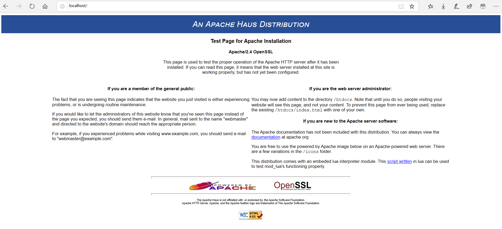
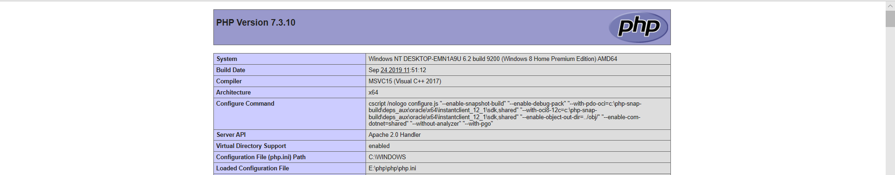
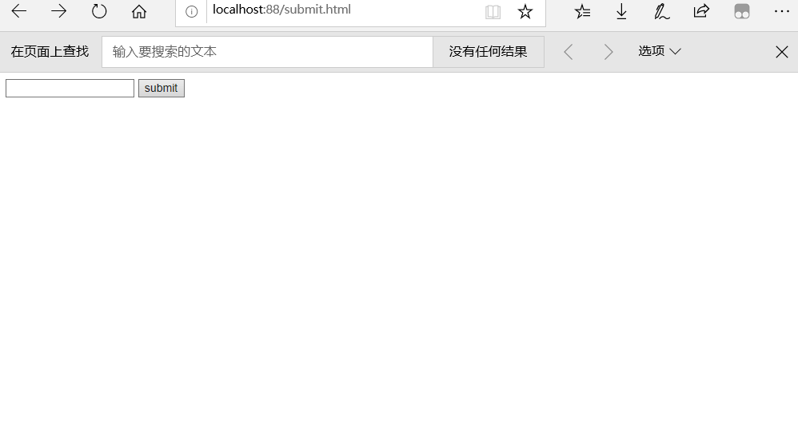
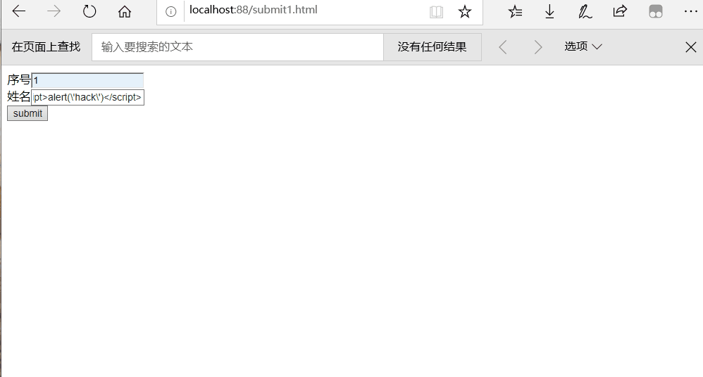
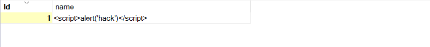
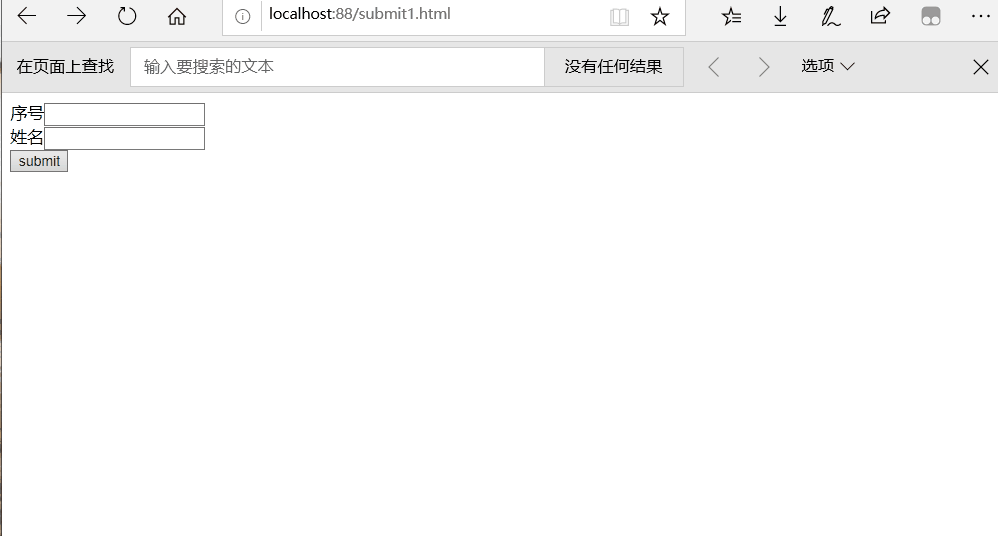

# XSS攻击

## 实验环境

- windows 10
- php、apache、mysql


## 实验内容

- [x] 反射型XSS攻击
- [x] 存储型XSS攻击

## 实验过程

[安装配置 apache、php](https://blog.csdn.net/qq_38002337/article/details/79354244) 






### 反射型XSS攻击

#### 原理

黑客先将含有XSS代码的恶意链接发送给目标用户，用户打开后，会访问链接对应的服务器，服务器收到链接请求时，会将带有的XSS代码的数据再次发送给用户，此时用户浏览器就会默认执行带有XSS代码的脚本，此时会触发XSS漏洞

#### 实验代码

```html
//前端submit.html
<html>
<head lang="en">
    <meta charset="UTF-8">
    <title>XSS</title>
</head>
<body>
    <form action="show.php" method="post">
        <input type="text" name="name" />
        <input type="submit" value="submit">
    </form>
</body>
</html>
 
//后端 show.php
<?php
    $name=$_POST["name"]; 
	echo $name;
?>
```

**正常提交** 



#### 简单的攻击

在输入框中提交数据： `<script>alert('hack')</script> `


### 存储型XSS攻击

#### 原理

攻击脚本会被永久的保存在目标服务器的数据库或者文件中（黑客会在某论坛进行留言，此时论坛对应的服务器会将黑客的留言保存在服务器，但是留言的内容有XSS恶意代码攻击，当其他用户访问此留言回帖时，浏览器就会执行XSS恶意代码）

#### 实验代码

```php
//前端 submit.html
<html>
<head lang="en">
    <meta charset="UTF-8">
    <title>XSS</title>
</head>
<body>
    <form action="mysql.php" method="post">
       序号<input type="text" name="id" /> <br/>
       姓名<input type="text" name="name" /> <br/>
        <input type="submit" value="submit">
    </form>
</body>
</html>

//后端：mysql.php
<?php
	$id=$_POST["id"];
	$name=$_POST["name"];
	$con=mysqli_connect("localhost","root","");
	mysqli_select_db($con,"test");
	
	$sql="insert into table value ($id,'$name')";
	$result=mysqli_query($con,$sql);
    if(!$result){
        echo "插入失败";
        }
    else { echo "插入成功"; }
?>

//供其他用户访问页面：show1.php
<?php
	$con=mysqli_connect("localhost","root","");
	mysqli_select_db($con,"test");
	$sql="select * from table where id=1";
	$result=mysqli_query($con,$sql);
	while($row=mysql_fetch_array($result)){
		echo $row['name'];
	}
?>
```


插入 `<script>alert('hack')</script> `



数据库显示



其他用户访问




