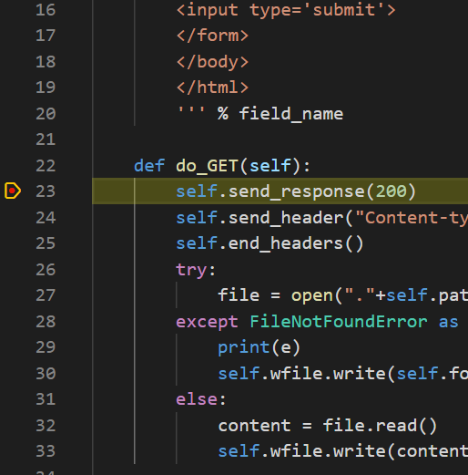
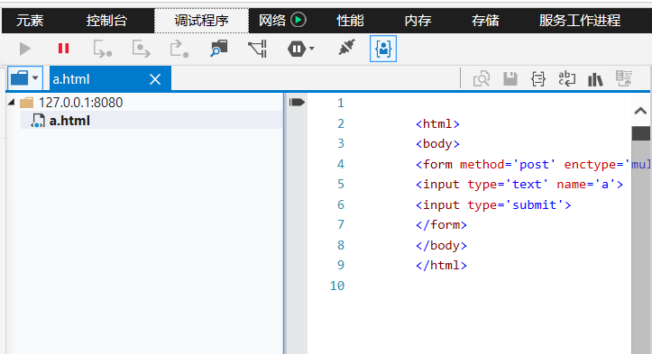
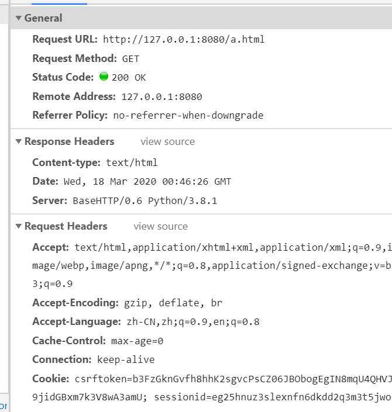
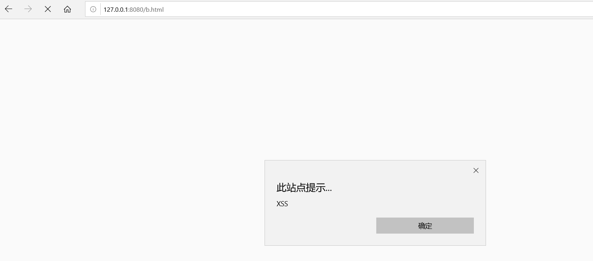
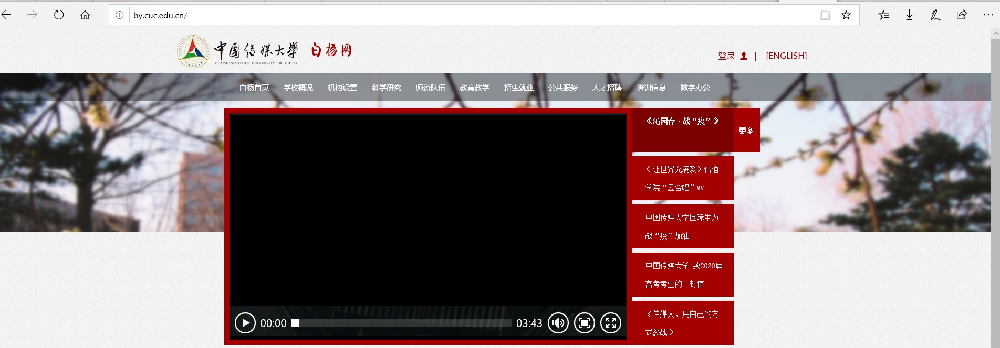
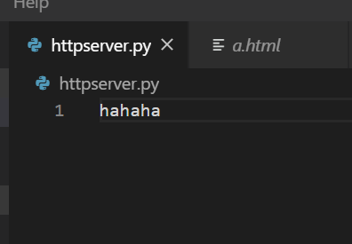
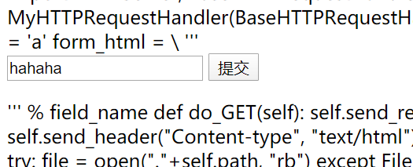

# httpserver

课内实验回顾

下载 httpserver.py 文件，用python来演示一下最基本的Web漏洞。这个代码很短但是至上有两个安全漏洞。

### 示例代码

```python
# -*- coding: utf-8 -*-

import sys
import cgi
from http.server import HTTPServer, BaseHTTPRequestHandler


class MyHTTPRequestHandler(BaseHTTPRequestHandler):
    field_name = 'a'
    form_html = \
        '''
        <html>
        <body>
        <form method='post' enctype='multipart/form-data'>
        <input type='text' name='%s'>
        <input type='submit'>
        </form>
        </body>
        </html>
        ''' % field_name

    def do_GET(self):
        self.send_response(200)
        self.send_header("Content-type", "text/html")
        self.end_headers()
        try:
            file = open("."+self.path, "rb")
        except FileNotFoundError as e:
            print(e)
            self.wfile.write(self.form_html.encode())
        else:
            content = file.read()
            self.wfile.write(content)

    def do_POST(self):
        form_data = cgi.FieldStorage(
            fp=self.rfile,
            headers=self.headers,
            environ={
                'REQUEST_METHOD': 'POST',
                'CONTENT_TYPE': self.headers['Content-Type'],
            })
        fields = form_data.keys()
        if self.field_name in fields:
            input_data = form_data[self.field_name].value
            file = open("."+self.path, "wb")
            file.write(input_data.encode())

        self.send_response(200)
        self.send_header("Content-type", "text/html")
        self.end_headers()
        self.wfile.write(b"<html><body>OK</body></html>")


class MyHTTPServer(HTTPServer):
    def __init__(self, host, port):
        print("run app server by python!")
        HTTPServer.__init__(self,  (host, port), MyHTTPRequestHandler)


if '__main__' == __name__:
    server_ip = "0.0.0.0"
    server_port = 8080
    if len(sys.argv) == 2:
        server_port = int(sys.argv[1])
    if len(sys.argv) == 3:
        server_ip = sys.argv[1]
        server_port = int(sys.argv[2])
    print("App server is running on http://%s:%s " % (server_ip, server_port))

    server = MyHTTPServer(server_ip, server_port)
    server.serve_forever()

```

### 运行代码

运行代码很简单  python httpserver.py，代码跑起来以后，就可以在浏览器中访问 http://127.0.0.1:8080/a.html


### 讲解代码

这个是使用python原生的cgi和http.server两个库运行的一个简单的http服务器程序。

因为没有使用第三方库，所有不需要使用pip安装依赖。运行比较简单。

61行，是程序入口

MyHTTPServer类，是继承自原生的HTTPSever，55行。

HTTPServer 重写了 init函数，增加了打印输出语言，然后字节调用父类的 init 传递了服务器运行需要的地址 端口 等参数。

我们的监听地址和端口是 0.0.0.0:8080。

关键是 MyHTTPRequestHandler 类，这个是 HTTPServer 的回调。用来处理到达的请求。

也就是0.0.0.0:8080 上有任何的HTTP请求到达时，都会调用 MyHTTPRequestHandler来处理。

MyHTTPRequestHandler 直接 继承自 BaseHTTPRequestHandler，其中 
BaseHTTPRequestHandler 的 do_GET和do_POST两个方法被重写

大家看 8-52，这个HTTP请求的处理类是整个代码的主体，也是出问题的地方。

https://developer.mozilla.org/en-US/docs/Web/HTTP/Methods

大家看这个链接 .http请求有如下这么多种methods，但是我们通常使用得最多的，是GET和POST，比如，大家直接在浏览器中输入链接，浏览器拿到地址以后，默认是采用GET方式向服务器发送请求。所以GET方式最常见。然后大家看代码14行，这里的表单是使用的post方法提交数据。所以通常来说，从服务器获取数据，使用get方面，向服务器提交数据，使用post方法。其他的方法，在现在的web应用程序中，用到的很少。

在 python 的 BaseHTTPRequestHandler 类中 ，do_XXX函数，就是处理对应的客户端请求的函数。所以在 58行指定了 MyHTTPRequestHandler 来处理 http请求，那么当用get方法请求，就会调用 do_GET,POST方法请求，就会调用 do_POST函数。这是python最基本的http 服务器的方式。这个主体结构大家理解了吧。


如果大家是在调试模式下运行的，那么现在可以在23行下个断点。刷新浏览器，代码就会断点命中中断。



### 处理的细节

会自动识别是什么样的http-method，是的，浏览器所发送的数据包里包括请求类型， 在http 的headers里，会说么方法。

这个大家可以结合浏览器，抓包看看http请求和响应的数据格式。用抓包器就能看到。或者在浏览器的调试模式也能看到。

大家看到 27行。self.path 是这个请求的路径 。

比如，我们这里的 http://127.0.0.1:8080/a.html 其中 http://127.0.0.1:8080是协议服务器地址和端口。/a.html就是路径。通常，一个静态的http服务器，这里的路径就是http服务器根目录下的文件，动态服务器这里可能是文件和参数，或者是对应其他服务器后台的处理过程。

例如 http://127.0.0.1:8080/a.php?p1=x  指定有a.php来处理这个请求，参数是p1=x，问号后面是参数，可以有多个，那么所以我们就去读 a.html文件。

一般来说，如果文件不存在，应该返回什么？  404

也就是23行那个 self.send_response(200)200按照协议 应该是404

但是我这里做了一个特殊的处理，如果指定的文件不存在，我还是返回200，表示请求路径是正确的，可以处理，然后返回一个默认的页面。

这个页面就是 form_html的变量，在FileNotFoundError异常处理过程中写回，wfile和rfile对应http响应和请求的body部分。

wfile和rfile对应http响应和请求的body部分。好，GET处理完成以后，浏览器就拿到了 200 状态的 "Content-type"为"text/html"的 form_html

大家现在打开浏览器的调试模式，chrome在菜单-更多工具，开发者工具里面。



到sources这个tab就看到了服务器向浏览器返回的数据，就是我们的form_html变量

这一段 html 浏览器渲染出来，就是那个带一个编辑框的表单。表单指定了使用post方式向服务器提交数据。另外插一句，network tab里可以看到完整的请求响应过程。




这是完整的网络数据 其中 header里就说了 GET或者POST

返回的状态码200等等

好，下面可以在表单中填入数据。点提交按钮。然后服务器的do_POST函数回被调用。

这里通过 cgi.FieldStorage解析了客户端提交的请求，原始的请求的头部在self.headers。body部分在self.rfile

解析完成以后放到 form_data变量里，其中form_data['field_name'].value 
就是你在编辑框中填入的数据，大家可以中断看一下。

通常，一个服务器会根据业务逻辑处理用户提交的数据，比如用户发表的商品评论，你们在我的在线教学系统中填入的作业，一般会写入数据库

但是这些数据，在某些情况下又会被显示出来，比如我批改你们的作业，其他用户看你的商品评论的时候。我们这里为了模拟这个过程，简化了一下，没有用户系统，也没有数据库。直接写入了文件。而且是写入path对应的文件。如果写入成功，就返回一个200，状态的OK，在 49-52行返回。44-47行处理了用户提交，写入文件。

#### 那么问题来了。漏洞也来了。

如果这时大家提交了一个 123 

fields = form_data.keys()是获取表单中的键值对，因此使用.value得到输入的值？这里获得是，对应的是form中input的name，15行

表单以变量名变量值的方式组织，input的name相当于变量名，你填入的数据就是变量值。python的cgi.FieldStorage将form组织为python的dict数据类型，所以可以通过  form_data['field_name'].value 获得所填入的数据

好，如果填入了 123 那么123被写入了a.html文件，执行完成后，你的目录下会多一个a.html，内容为123


然后你下次再访问 http://127.0.0.1:8080/a.html 时，在浏览器地址栏里回车，由于这个时候a.htm已经存在了所以是运行的31-33行的else部分，直接把文件内容会写给浏览器，这里时在简化模拟用户提交数据-存入数据-其他用户获取这个数据的过程。这里有就XSS漏洞了。

下面大家再访问一个不存在的页面，比如b.html，又会出现那个默认的form。如果这时我们输入范文庆-班主任:
<html><body><script>alert('XSS')</script></form></body></html>

这段内容就会被写入b.html

然后在访问b.html的时候，整个页面被载入 script在浏览器上执行


也就是“用户提交的数据被执行了”，效果出来了吗？



理论上，任何的js都是可以被执行的。js可以实现非常丰富的功能。
比如可以让你扫码支付

比如在 c.html里填入

<html><body><script>window.location.href='http://by.cuc.edu.cn'</script></form></body></html>

下次再访问c.html的时候。页面跳转了。

这就是 window.location.href='http://by.cuc.edu.cn' 这段脚本的功能。




不要用刷新，刷新是重复上一次的POST请求，

如果是没有基本防御措施的网站 这段会被放进服务器数据库里 然后别人提交了数据就自动跳转到这个网站吗？

是的，比如有一个商品A，你在评论里输入了一段js代码。如果服务器不做处理直接保存。后面的的用户访问商品A是，看评论，你输入的代码就会在其他用户的页面上执行。比如骗去用户支付，实际到账你的账户。这个漏洞的原理和效果大家理解了吧。

#### 下面还有更严重的漏洞

如果大家在浏览器中访问 http://127.0.0.1:8080/httpserver.py  看看效果


在sources中，是不是我们的源代码。全部完整的？是的

由于服务器没有做任何过滤，只要是存在的文件，就发送给客户端，源代码文件也发送给了客户端。现在黑客可以知道我整个后台的逻辑了。如果还有一些配置文件，比如数据库地址和访问口令等。那就更严重了。更严重的是，黑客甚至可以注入后端代码。

由于我们是回写到文件，你可以构造一个http post请求，把httpserver.py文件改写了。

但是构造这个请求用浏览器就不行了，需要采用curl等更基础的工具裸写post请求发送给服务器的

#### 下面我简单示范一下

大家到调试工具的 elements哪里，由于后台只处理名为a的表单项，写入文件，所以我们需要把input的name改为a


改为以后，提交。
看看。httpserver.py，它变了。



比如输入hahaha，把 name="%s" 改为 name="a" 再提交 




所以，我们甚至可以给后端注入代码。那么，我们就想干嘛了。

当然，如果只是注入一个hahaha 服务器就挂了。再也跑不起来了。因为他不是一个可以运行的python

所以，这是一个及其简单，但是漏洞百出的web服务器。这就是不做任何过滤，直接写入数据的危害。 

