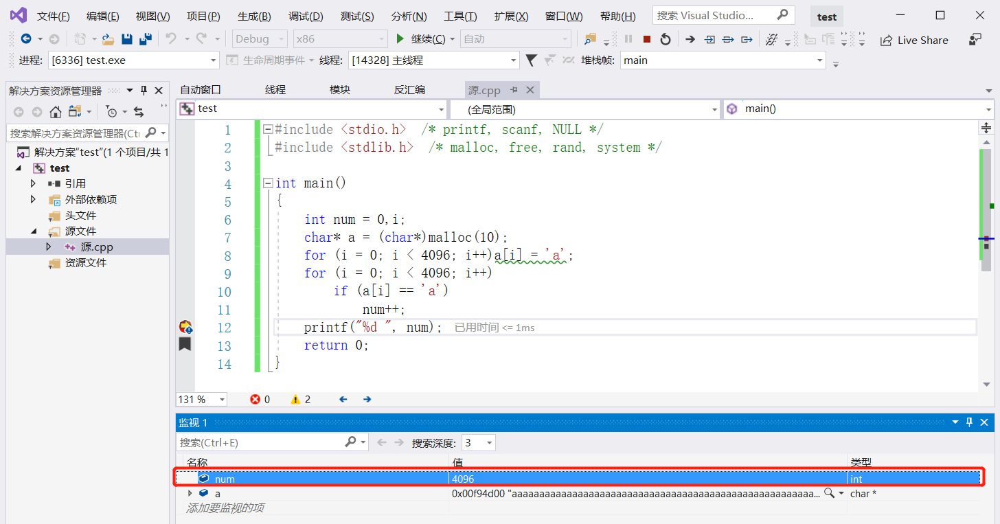
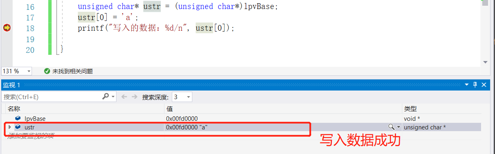
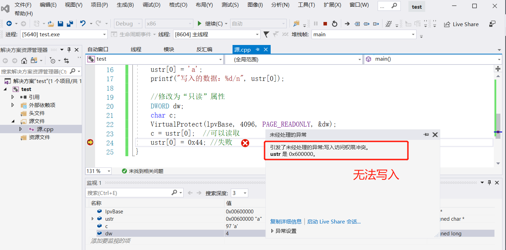
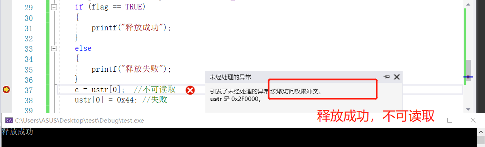
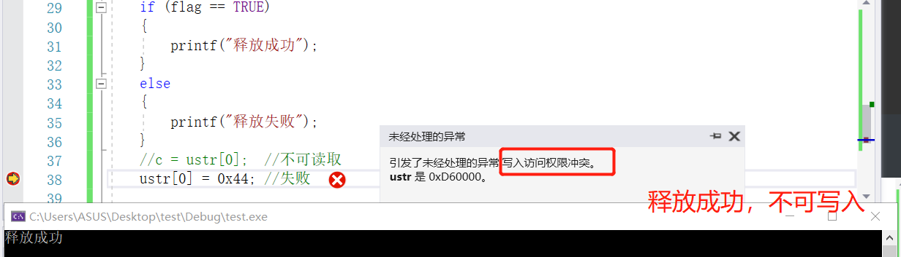
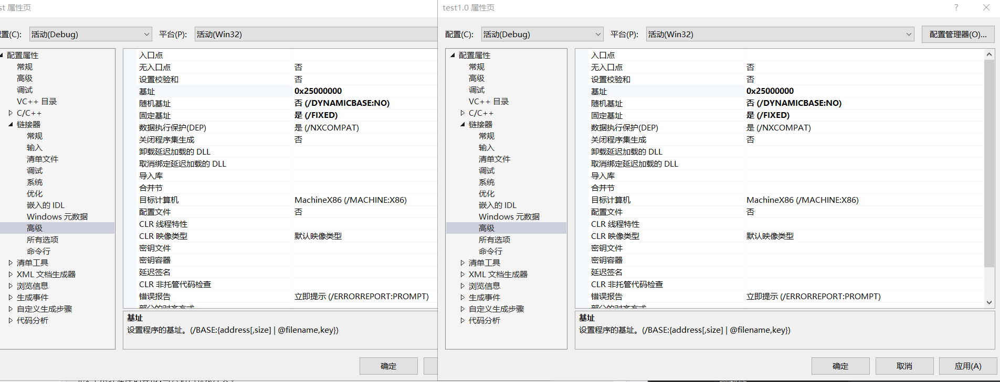
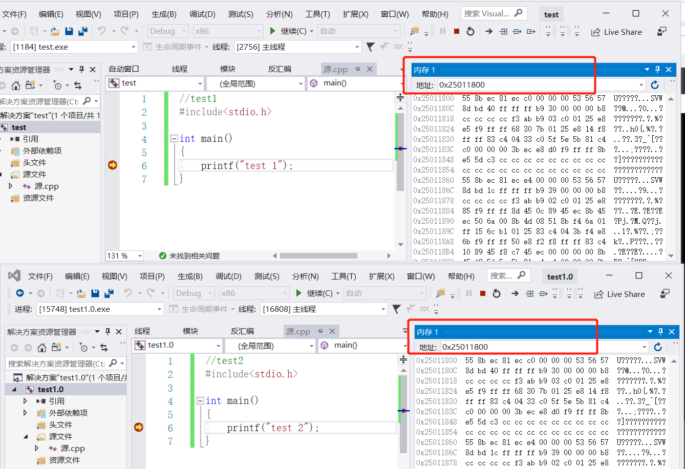
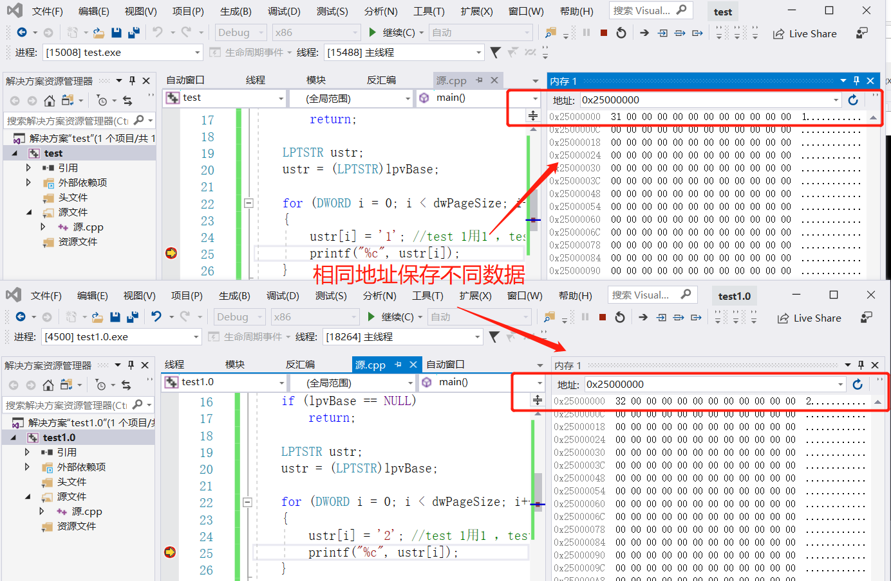
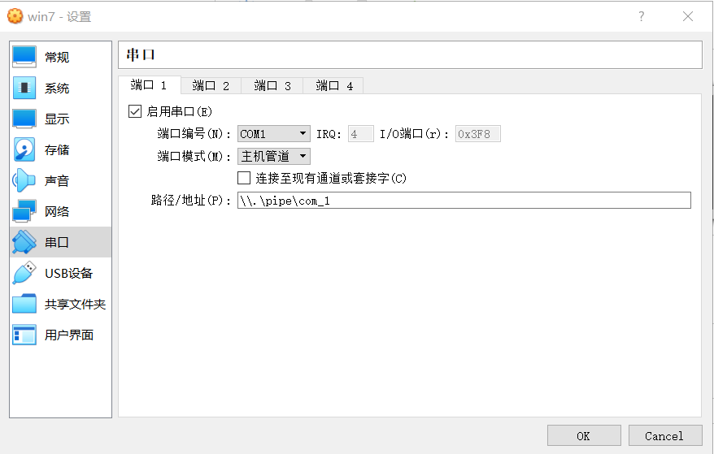
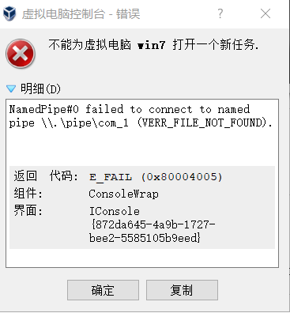

# 内存管理

## 实验过程

### 一、阅读官方文档

- [virtual protect](https://docs.microsoft.com/en-us/windows/win32/api/memoryapi/nf-memoryapi-virtualprotect)
- [virtual free](https://docs.microsoft.com/en-us/windows/win32/api/memoryapi/nf-memoryapi-virtualfree)
- [virtual alloc](https://docs.microsoft.com/en-us/windows/win32/api/memoryapi/nf-memoryapi-virtualalloc)


### 二、使用malloc分配一段内存

```c
#include<stdio.h>
#include <stdlib.h> 
#include<malloc.h>


 
int main()
{
	int num = 0;
	char* a = (char*)malloc(10); //分配10个字节的空间
	for (int i = 0; i < 4096; i++)
		a[i] = 'a';
	for (int i = 0; i < 4096; i++)
		if (a[i] == 'a')
			num++;

	return 0;
}
```



从实验结果4KB数据都是可写且可读的


### 三、使用virtualAlloc分配一段内存

1、分配可读可写内存

```c
#include <windows.h>
#include <stdio.h> 
#include <stdlib.h> 
void main()
{
	
	LPVOID lpvBase = VirtualAlloc(
		NULL,                 // system selects address 分配地址
		4096,     // size of allocation 分配大小
		MEM_COMMIT,   // allocate reserved pages 内存分配类型
		PAGE_READWRITE
	);       // protection = no access   对要分配的页面区域的内存保护
	if (lpvBase == NULL )   
		return;
	//向内存写入数据
	unsigned char *ustr = (unsigned char *)lpvBase;
	ustr[0] = 'a';
	printf("写入的数据：%d/n", ustr[0]);
	
}
```



2、将内存改为只读，再读数据和写数据

```c
#include <windows.h>
#include <stdio.h> 
#include <stdlib.h> 
void main()
{
	LPVOID lpvBase = VirtualAlloc(
		NULL,                 // system selects address
		4096,     // size of allocation
		MEM_COMMIT,   // allocate reserved pages
		PAGE_READWRITE
	);       // protection = no access   
	if (lpvBase == NULL )   
		return;
	//向内存写入数据
	unsigned char *ustr = (unsigned char *)lpvBase;
	ustr[0] = 'a';
	printf("写入的数据：%d/n", ustr[0]);
	
	//修改为“只读”属性
	DWORD dw;
	char c;
	VirtualProtect(lpvBase, 4096, PAGE_READONLY, &dw);
	c = ustr[0];  //可以读取
	ustr[0]=0x44; //失败
}
```



3、VirtualFree释放这段内存，再测试对这段内存的读写释放正常

```c
#include <windows.h>
#include <stdio.h> 
#include <stdlib.h> 
void main()
{
	BOOL flag;
	LPVOID lpvBase = VirtualAlloc(
		NULL,                 // system selects address
		4096,     // size of allocation
		MEM_COMMIT,   // allocate reserved pages
		PAGE_READWRITE
	);       // protection = no access   
	if (lpvBase == NULL )   
		return;
	//向内存写入数据
	unsigned char *ustr = (unsigned char *)lpvBase;
	ustr[0] = 'a';
	
	
	//修改为“只读”属性
	DWORD dw;
	char c;
	VirtualProtect(lpvBase, 4096, PAGE_READONLY, &dw);
	c = ustr[0];  //可以读取
	//ustr[0]=0x44; //失败

	// virtualfree
	flag = VirtualFree(lpvBase,4096, MEM_DECOMMIT);
	if (flag == TRUE)
	{
		cout << "释放成功"<<endl;
	}
	else
	{
		cout << "释放失败" << endl;
	}
	//c = ustr[0];  //不可读取
	ustr[0] = 0x44; //失败

}
```

释放成功后，不可再进行读取



释放成功后，不可再进行写入



### 四、内存地址保护

- 不同进程的相同的地址可以保存不同的数据。
  - 设置固定基地址，编写两个不同可执行文件，同时运行这两个文件。然后使用调试器附加到两个程序的进程，查看内存，看两个程序是否使用了相同的内存地址；
  - 在不同的进程中，尝试使用VirtualAlloc分配一块相同地址的内存，写入不同的数据。再读出。

```c
//test1
#include<stdio.h>

int main()
{
	printf("test 1");
}
//test2
#include<stdio.h>

int main()
{
	printf("test 2");
}
```


设置相同固定基址



执行上述两段代码，查看结果，两个程序的地址完全相同，但是正常执行，可见不同进程的相同的地址可以保存不同的数据




新建两个工程，同时执行以下代码，地址相同保存不同数据，由此可见系统的内存保护

```c
#include <windows.h>
#include<stdio.h>
void main()
{

    SYSTEM_INFO sSysInfo;	// Useful information about the system
    GetSystemInfo(&sSysInfo);
    DWORD dwPageSize = sSysInfo.dwPageSize;

    //分配内存，标记为提交、可读可写
    LPVOID lpvBase = VirtualAlloc(
        (LPVOID)0x25000000,	// The starting address of the region to allocate
        dwPageSize,
        MEM_COMMIT | MEM_RESERVE,
        PAGE_READWRITE);
    if (lpvBase == NULL)
        return;

    LPTSTR ustr;
    ustr = (LPTSTR)lpvBase;
  
    for (DWORD i = 0; i < dwPageSize; i++)
    {
        ustr[i] = '1'; //test 1用1 ，test2用2
        printf("%c", ustr[i]);
    }
   
    return;

}
```



### 五、windbg

- 配置一个Windbg双机内核调试环境，查阅Windbg的文档，了解
  - Windbg如何在内核调试情况下看物理内存，也就是通过物理地址访问内存
  - 如何查看进程的虚拟内存分页表，在分页表中找到物理内存和虚拟内存的对应关系。然后通过Windbg的物理内存查看方式和虚拟内存的查看方式，看同一块物理内存中的数据情况。

- 虚拟机装好windows7系统（xp即可），主机上安装好[windbg](https://docs.microsoft.com/en-us/windows-hardware/drivers/debugger/debugger-download-tools)

- 为虚拟机配置虚拟串口，为建立 HOST 到 GUEST 的调试通信连接

  

出现错误：NamedPipe#0 failed to connect to named pipe \\.\pipe\com_1 (VERR_FILE_NOT_FOUND)1




- 在虚拟机中以管理员身份运行CMD命令行，输入`bcdedit`命令，查看到系统的当前启动项，如果是新的系统，则只会有一个 `{current}` 的启动项。

- 执行下方的三条命令，依次建立启动项，并激活调试模式。

  ```bash
  bcdedit /copy {current} /d "Windwos7"
  bcdedit /debug ON
  bcdedit /bootdebug ON
  bcdedit /timeout 10
  ```

  

- 查看当前调试配置选项，执行命令 `bcdedit /dbgsettings`

- 配置完成，重新启动系统，开机时选择`Windows7 [启用调试程序]`系统黑屏，说明正常进入调试模式

- a

- a

- a